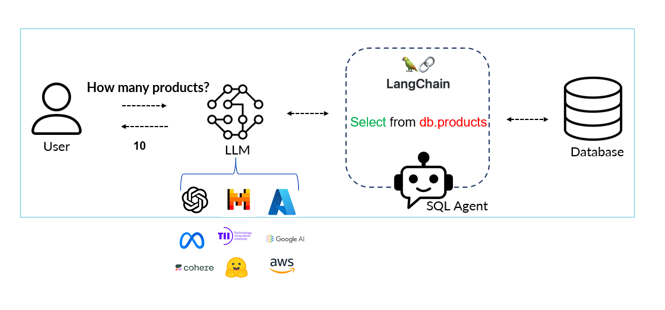

# Talk to Your SQL Database

This project demonstrates how to use Natural Language Processing (NLP) and Large Language Models (LLMs) to interact with an SQL database using LangChain.

## Features
- Convert natural language queries into SQL
- Use LangChain's SQL Agent for seamless database interaction
- Improve accessibility for non-technical users

## Technologies Used
- Python
- LangChain
- SQL Databases
- Azure OpenAI API

## Getting Started
1. Clone this repository:
   ```bash
   git clone https://github.com/your-username/your-repo-name.git
# Talk to Your SQL Database

This project demonstrates how to use Natural Language Processing (NLP) and Large Language Models (LLMs) to interact with an SQL database using LangChain.

## Features
- Convert natural language queries into SQL
- Use LangChain's SQL Agent for seamless database interaction
- Improve accessibility for non-technical users

## Technologies Used
- Python
- LangChain
- SQL Databases
- OpenAI API

## Getting Started
1. Clone this repository:
   ```bash
   git clone https://github.com/your-username/your-repo-name.git
2. Install dependencies:

   pip install -r requirements.txt

3. Run the application:
   streamlit run app.py


